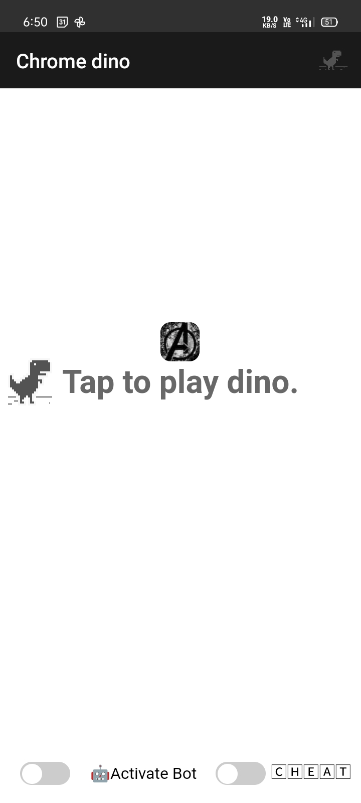
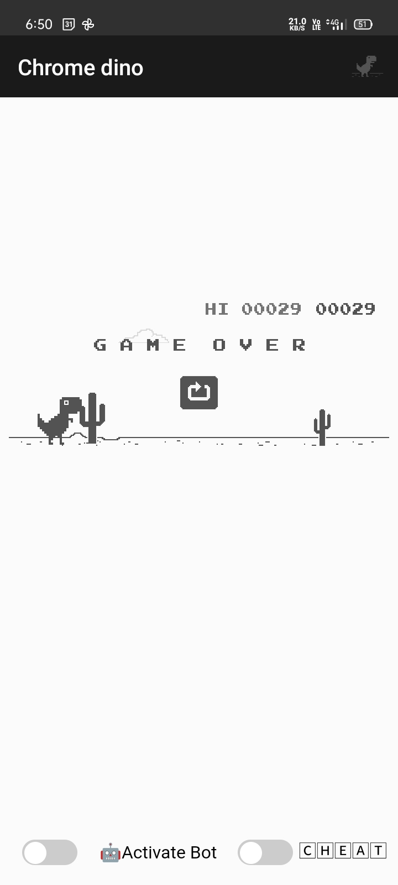

# Chrome Dino

🦖Chrome Dino with Bot Game

This is a fun project that recreates the classic Chrome Dino game with an added twist of a bot playing alongside you. The game is built using HTML, CSS, and JavaScript.

## How to Play
1. Clone or download the repository.
2. Install the application or Open the `index.html` file in your acode app or any HTML editor and run the file.
3. Press the spacebar to start the game. The Chrome Dino will start running.
4. The bot will automatically play the game alongside you, jumping over obstacles and earning points.

## Features
- Classic Chrome Dino game experience.
- Bot that plays the game with you.
- Score tracking and display.

Feel free to contribute to the project by making improvements or adding new features. If you encounter any issues, please report them in the Issues section.

## Screenshots

---

Contact me on Facebook: [Abid Hasan Sojib](https://www.facebook.com/abidhasansojib002)

---

Enjoy the game! 😄🦕

